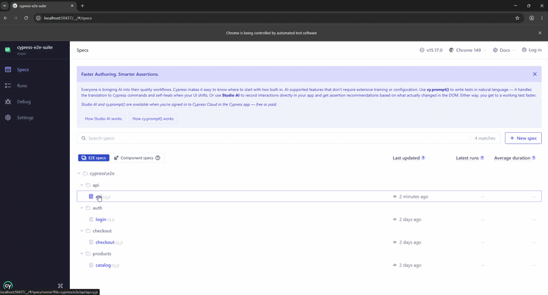

# cypress-e2e-suite

Suite de tests E2E automatizados con Cypress sobre [Sauce Demo](https://www.saucedemo.com) — una tienda de e-commerce de práctica. Cubre flujos de autenticación, catálogo de productos y proceso de checkout.

---

## Demo



---

## Tests incluidos

### Auth (`cypress/e2e/auth/login.cy.js`)
- Login exitoso con credenciales válidas
- Error con usuario bloqueado
- Error con credenciales inválidas
- Logout exitoso

### Products (`cypress/e2e/products/catalog.cy.js`)
- Muestra 6 productos después del login
- Ordenar productos de menor a mayor precio
- Agregar producto al carrito
- Ver detalle de un producto

### Checkout (`cypress/e2e/checkout/checkout.cy.js`)
- Completar proceso de compra end-to-end
- Checkout con carrito vacío
- Error si faltan datos en el formulario

---

## Stack


---

## Estructura

```
cypress-e2e-suite/
├── cypress/
│   ├── e2e/
│   │   ├── auth/
│   │   │   └── login.cy.js
│   │   ├── products/
│   │   │   └── catalog.cy.js
│   │   └── checkout/
│   │       └── checkout.cy.js
│   ├── fixtures/
│   │   └── users.json
│   └── support/
│       ├── commands.js
│       └── e2e.js
├── cypress.config.js
├── package.json
├── .gitignore
└── LICENSE
```

---

## Instalación

```bash
git clone https://github.com/JxsueMd16/cypress-e2e-suite.git
cd cypress-e2e-suite
npm install
```

## Correr los tests

Modo interactivo (abre Cypress):
```bash
npx cypress open
```

Modo headless (terminal):
```bash
npx cypress run
```

---

## Contacto

[](mailto:josuemorandelacruz16@gmail.com)
